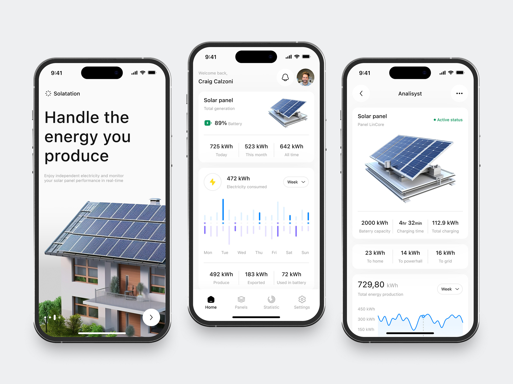

# JP-Energize

### Willkommen zu meinem neuen Projekt in IOS/SwiftUI JP Energize

JP Energize wird eine coole App, die es Leuten ermöglicht, ihre Solarenergie optimal zu nutzen, zu speichern und sogar mit der Community zu teilen. Sie ist perfekt für alle, die ihren eigenen Strom produzieren und Teil einer smarten Energie-Zukunft sein wollen!

## Design

### Das Bild ist ein Schema, welches als Inspiration dient.

## Features

- [x] Intelligentes Energiemanagement: Automatische Steuerung deiner Solaranlage und deines Batteriespeichers.

- [x] Peer-to-Peer Energiehandel: Teile oder handel deine überschüssige Energie mit deinen Nachbarn.

- [x] Gemeinsame Batteriespeicher: Investiere zusammen mit anderen in größere Speicher und nutzt sie gemeinsam.

## Technologien

### Xcode und SwiftUI

### [MVVM-Architektur](https://www.avanderlee.com/swiftui/mvvm-architectural-coding-pattern-to-structure-views/):
Für sauberen und gut strukturierten Code.

### [API-Anbindung](https://developer.nrel.gov/docs/solar/pvwatts/v8/#request-url):
Damit die App mit Solar- und Batteriesystemen und dem Marktplatz reden kann.

### Firebase: Für die einfache Handhabung von User-Daten, Authentifizierung und Echtzeit-Datenbanken.

## Setup

### 1. Xcode Projekt erstellen

### 2. MVVM-Architektur verwenden

### 3. Views: UI in SwiftUI

### 4.ViewModels: Hier kommt die Logik rein, die zwischen den Views und Modellen vermittelt.

### 5. API-Anbindung: PVWatts V8

### 6. Firebase einbinden

### 7. Testen durch Simulator/ physisches Iphone

## Ausblick: Was soll noch folgen ?

- [x] Notfallreserven: Teile Energie für den Notfall, damit alle sicher durch den Stromausfall kommen.

- [x] Energiebilanz: Behalte den Überblick über deine Einsparungen und deinen Beitrag zur Umwelt.

